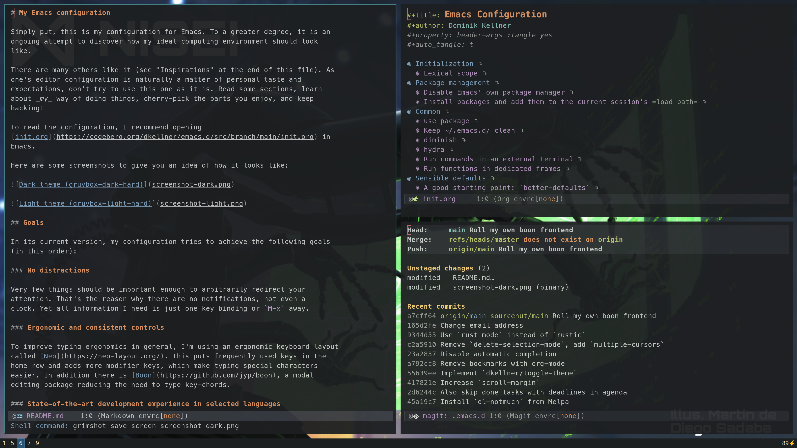

# My Emacs configuration

Simply put, this is my configuration for Emacs. To a greater degree, it is an
ongoing attempt to discover how my ideal computing environment should look
like.

There are many others like it (see "Inspirations" at the end of this file). As
one's editor configuration is naturally a matter of personal taste and
expectations, don't try to use this one as it is. Read some sections, learn
about _my_ way of doing things, cherry-pick the parts you enjoy, and keep
hacking!

To read the configuration, I recommend opening
[init.org](https://codeberg.org/dkellner/emacs.d/src/branch/main/init.org) in
Emacs.

Here are some screenshots to give you an idea of how it looks like:

## Goals

In its current version, my configuration tries to achieve the following goals
(in this order):

### No distractions

Very few things should be important enough to arbitrarily redirect your
attention. That's the reason why there are no notifications, not even a
clock. Yet all information I need is just one key binding or `M-x` away.

### Ergonomic and consistent controls

To improve typing ergonomics in general, I'm using an ergonomic keyboard layout
called [Neo](https://neo-layout.org/). This puts frequently used keys in the
home row and adds more modifier keys, which make typing special characters
easier. In addition there is [Boon](https://github.com/jyp/boon), a modal
editing package reducing the need to type key-chords.

### State-of-the-art development experience in selected languages

Setting up Emacs to support the programming language of your choice is one of
the most fun but also hardest tasks. Usually there are at least a dozen
different packages to consider, try out and integrate into your workflow.

I'm trying to unify different language-dependent solutions using
[Nix](https://nixos.org/nix/), [direnv](https://direnv.net/) and LSP. For
Python and Rust this works reasonably well.

## Inspirations

- https://github.com/alhassy/emacs.d
- https://github.com/dakra/dmacs
- https://writequit.org/eos/eos.html
- ... and many others
